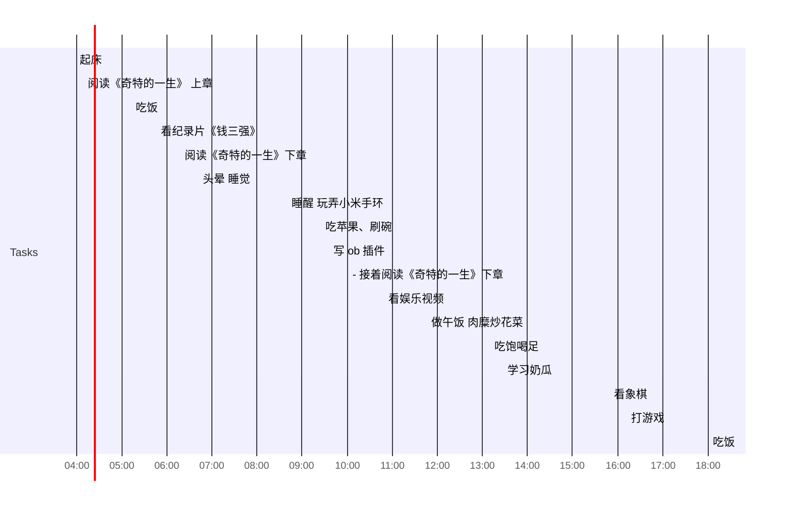

## Day Planner

- [ ] 制定计划
- [ ] 总结
---

### 上午

- [ ] 03:58 起床
- [ ] 04:09 阅读《奇特的一生》 上章
- [ ] 05:12 吃饭
- [ ] 05:45 看纪录片《钱三强》
- [ ] 06:17 阅读《奇特的一生》下章
- [ ] 06:42 头晕 睡觉
- [ ] 08:40 睡醒 玩弄小米手环
- [ ] 09:25 吃苹果、刷碗
- [ ] 09:35 写 ob 插件
- [ ] 10:01 -  接着阅读《奇特的一生》下章
- [ ] 10:49 看娱乐视频
- [ ] 11:46 做午饭 肉糜炒花菜
- [ ] 13:09 吃饱喝足
- [ ] 13:26 学习奶瓜
- [ ] 15:48 看象棋
- [ ] 16:11 打游戏
- [ ] 18:20 学习
- [ ] 19:40 水群
- [ ] 21:01 睡觉

水群 7 分钟

## 总结

| 类型     | 时长 |
| -------- | ---- |
| 学习时长 | 3.12 |
| 娱乐时长 | 1.49 |
| 读书     | 3.03 |
| 课外阅读 | 0.33 |
| 日常消耗 | 2    |
| 睡眠     | 8.38 |
|闲聊|1.5|

