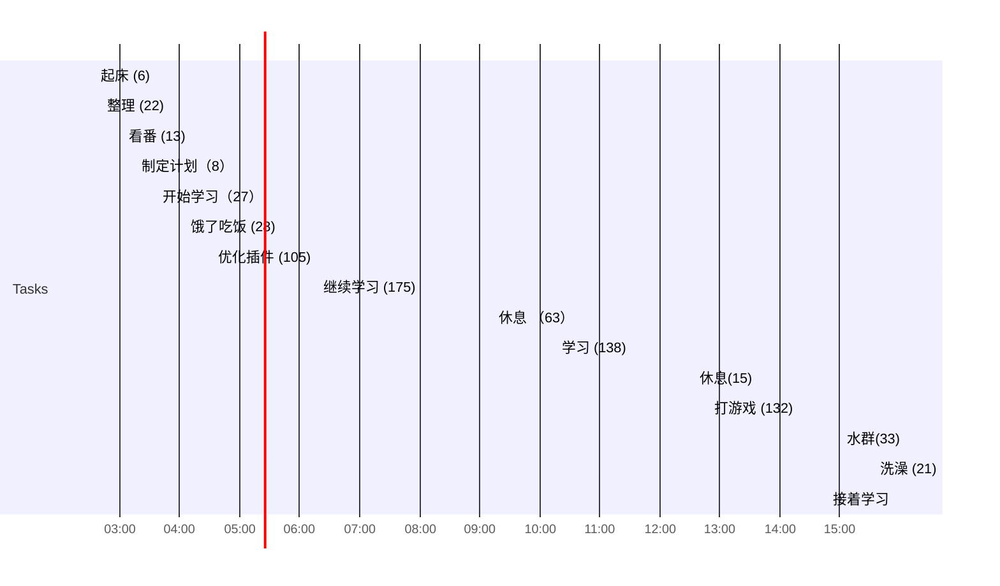

## Day Planner

## 每日必做
- [ ] UE自制物品系统 252（300）
https://space.bilibili.com/55245483/channel/seriesdetail?sid=1346738

# 

- [ ] TT脑思奶瓜 259
https://www.bilibili.com/video/av333439252

## 日常

- [ ] 02:35 起床 (6)
- [ ] 02:41 整理 (22)
- [ ] 03:03 看番 (13)
- [ ] 03:16 制定计划（8）
- [ ] 03:37 开始学习（27）
- [ ] 04:04 饿了吃饭 (28)
- [ ] 04:32 优化插件 (105)
- [ ] 06:17 继续学习 (175)
- [ ] 09:12 休息 （63）
- [ ] 10:15 学习  (138)
- [ ] 12:33 休息(15)
- [ ] 12:48 打游戏 (132)
- [ ] 15:01 水群(33)
- [ ] 15:34 洗澡 (21)
- [ ] 15:55 接着学习 (175)
- [ ] 19:00 睡觉

## 总结

| 类型     | 时长 |
| -------- | ---- |
| 学习     | 515  |
| 娱乐     | 144  |
| 读书     | 0    |
| 课外阅读 | 105  |
| 日常消耗 | 127  |
| 睡眠     | 333  |
| 闲聊     | 33   |
| 总计     | 1257 |

## 立刻完成自己讨厌的事情
- [ ] 吃完饭立刻洗碗
- [ ] 吃完东西要漱口
