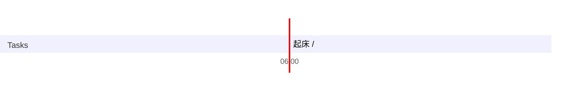

## Day Planner

## 今日学习方向
- [ ] 蓝图
- [ ] 

## 日常

- [ ] 02:51 起床 
- [ ] 03:25 开发插件  (33)
- [ ] 03:57 UE 蓝图  (86)
- [ ] 05:23 吃饭 (32)
- [ ] 05:55 看纪录片  (45)
- [ ] 06:59 睡觉 (111)
- [ ] 08:51 看纪录片 (41)
- [ ] 09:33 学习 (97)
- [ ] 11:10 看番 (23)
- [ ] 11:33 打游戏 (558)
- [ ] 20:51 睡觉

## 总结

| 类型 | 时长 |
| ---- | ---- |
| 学习 | 184  |
| 娱乐 | 558  |
| 读书 | 0    |
| 课外 | 86   |
| 开发 | 33   |
| 闲聊 | 30   |
| 睡眠 | 582  |
| 总计 | 1473 |

## 立刻完成自己讨厌的事情
- [ ] 吃完饭立刻洗碗
- [ ] 吃完东西要漱口
