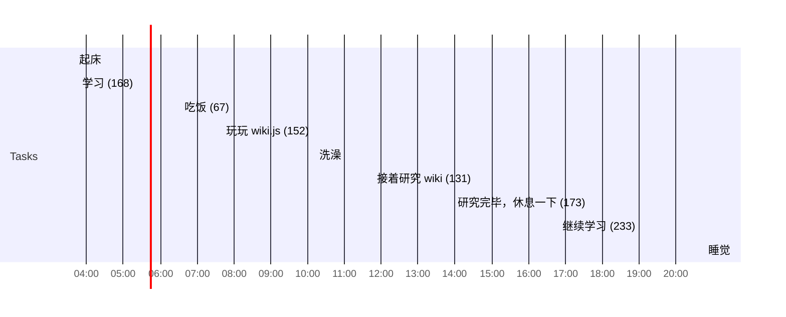

## Day Planner

## 今日学习方向
- [ ] 蓝图
- [ ] 

20.51
## 日常

- [ ] 03:40 起床
- [ ] 03:45 学习 (168)
- [ ] 06:32 吃饭 (67)
- [ ] 07:39 玩玩  wiki.js (152)
- [ ] 10:11 洗澡
- [ ] 11:45 接着研究 wiki (131)
- [ ] 13:56 研究完毕，休息一下 (173)
- [ ] 16:48 继续学习 (233)
- [ ] 20:45 睡觉

## 总结

| 类型 | 时长 |
| ---- | ---- |
| 学习 | 401  |
| 娱乐 | 0    |
| 读书 | 0    |
| 课外 | 0    |
| 开发 | 325  |
| 闲聊 | 0    |
| 睡眠 | 469  |
| 总计 | 1195 |

## 立刻完成自己讨厌的事情
- [ ] 吃完饭立刻洗碗
- [ ] 吃完东西要漱口

