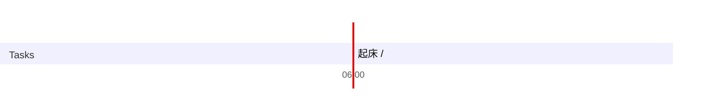

## Day Planner

## 今日学习方向
- [ ] 
- [ ] 

## 日常

- [ ] 03:59 起床 
- [ ] 04:25 学习 (27)
- [ ] 04:52 饿了
- [ ] 06:15 学习 (37)
- [ ] 06:52 睡觉 (67)
- [ ] 07:59 学习(152)
- [ ] 10:05 闲聊 (26)
- [ ] 10:31 学习 (49)
- [ ] 11:19 游戏 (61)
- [ ] 12:20 吃饭 (113)
- [ ] 14:13 看纪录片 (80)
- [ ] 15:33  困了(111)
- [ ] 17:24 闲聊 (55)
- [ ] 18:19 PHP (162)
- [ ] 21:01 吃水果
- [ ] 21:25 学习 (185)
- [ ] 00:30 睡觉

## 总结

| 类型 | 时长 |
| ---- | ---- |
| 学习 | 460  |
| 娱乐 | 61   |
| 读书 | 0    |
| 课外 | 80   |
| 开发 | 0    |
| 闲聊 | 91   |
| 睡眠 | 435  |
| 总计 | 1127 |

## 立刻完成自己讨厌的事情
- [ ] 吃完饭立刻洗碗
- [ ] 吃完东西要漱口

## 格言
不走捷径，就是捷径

如果一个东西研究 1 小时还是茫然，还是先提升相关技能吧。
