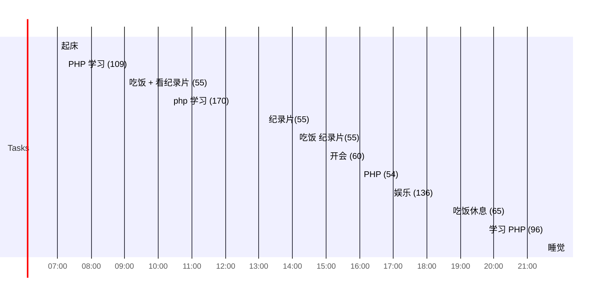

## Day Planner

## 今日学习方向
- [ ] 
- [ ] 

## 日常

- [ ] 07:00 起床
- [ ] 07:12 PHP 学习 (109)
- [ ] 09:01 吃饭 + 看纪录片 (55)
- [ ] 10:20 php 学习 (170)
- [ ] 13:10 纪录片(55)
- [ ] 14:05 吃饭 纪录片(55)
- [ ] 15:00 开会 (60)
- [ ] 16:00 PHP (54)
- [ ] 16:54 娱乐 (136)
- [ ] 18:40 吃饭休息 (65)
- [ ] 19:45 学习 PHP (96)
- [ ] 21:30 睡觉

## 总结

| 类型 | 时长 |
| ---- | ---- |
| 学习 | 429  |
| 娱乐 | 136  |
| 读书 | 0    |
| 课外 | 165  |
| 开发 | 0    |
| 闲聊 | 29   |
| 睡眠 | 390  |
| 总计 | 1149 |

## 立刻完成自己讨厌的事情
- [ ] 吃完饭立刻洗碗
- [ ] 吃完东西要漱口

## 格言
不走捷径，就是捷径

如果一个东西研究 1 小时还是茫然，还是先提升相关技能吧。
