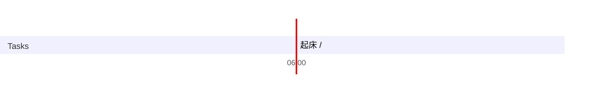

## Day Planner

## 今日学习方向
- [ ] https://www.runoob.com/php/func-string-htmlspecialchars.html
- [ ] https://www.bilibili.com/bangumi/play/ep121271
- [ ] http://localhost/index.php

## 记录

- [ ] 05:49 起床
- [ ] 06:05 学习  (92)
- [ ] 07:37 洗澡
- [ ] 08:05 学习 (72)
- [ ] 09:17 吃饭 (203)
- [ ] 12:39 学习 (24)
- [ ] 12:53 睡觉 (95)
- [ ] 14:28 网站 (47)
- [ ] 15:15 学习 (167)
- [ ] 18:02 游戏 (70)
- [ ] 19:12 吃饭
- [ ] 19:38 go 语言 (82)
- [ ] 23:00 睡觉

## 总结

| 类型 | 时长 |
| ---- | ---- |
| 学习 | 435  |
| 娱乐 | 70   |
| 读书 | 0    |
| 课外 | 0    |
| 开发 | 47    |
| 闲聊 | 0    |
| 睡眠 | 562  |
| 总计 | 1114 |

## 立刻完成自己讨厌的事情
- [ ] 吃完饭立刻洗碗
- [ ] 吃完东西要漱口

## 格言

不走捷径，就是捷径

如果研究 1 小时还是茫然，还是先提升相关技能吧，别死磕。

可以夜里把今天的总结了，并且把明天的工作安排好
