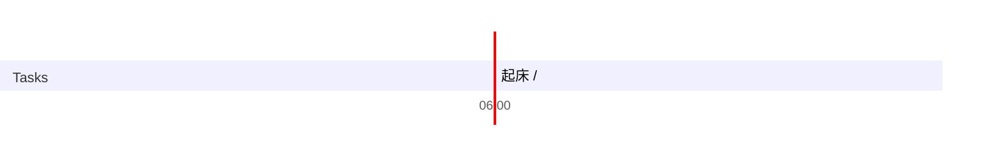

## Day Planner

## 今日学习方向
- [ ] 
- [ ] 

## 日常

- [ ] 05:24 起床 
- [ ] 05:40 闲聊 (57)
- [ ] 06:24 GO (115)
- [ ] 08:18 吃饭+纪录片 (116)
- [ ] 10:14 睡会 (71)
- [ ] 11:25 go (120)
- [ ] 13:25 game (126)
- [ ] 15:31 go (246)
- [ ] 19:37 吃饭 (39)
- [ ] 20:16 VUE (58)
- [ ] 21:14 洗澡
- [ ] 21:42 网站 (99)
- [ ] 23:21 game  (57)
- [ ] 00:14 闲聊 (25)
- [ ] 00:39 睡觉

## 总结

| 类型 | 时长 |
| ---- | ---- |
| 学习 | 0    |
| 娱乐 | 57   |
| 读书 | 0    |
| 课外 | 116  |
| 开发 | 638  |
| 闲聊 | 57   |
| 睡眠 | 446  |
| 总计 | 1314 |

## 立刻完成自己讨厌的事情
- [ ] 吃完饭立刻洗碗
- [ ] 吃完东西要漱口

## 格言
不走捷径，就是捷径

如果一个东西研究 1 小时还是茫然，还是先提升相关技能吧。

可以夜里把今天的总结了，并且把明天的工作安排好
