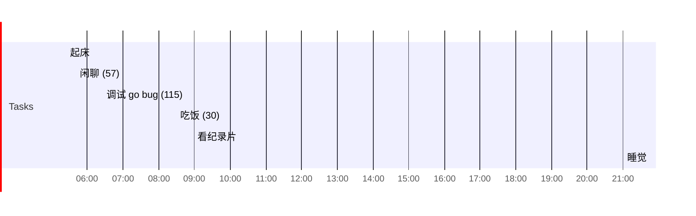

## Day Planner

## 今日学习方向
- [ ] 
- [ ] 

## 记录

- [ ] 06:08 赖床
- [ ] 06:37 写文章(149)
- [ ] 09:05 吃饭 (105)
- [ ] 10:50 game (131)
- [ ] 13:01 闲聊 (15)
- [ ] 13:25 看纪录片 (40）
- [ ] 14:05 睡觉 (114)
- [ ] 16:02 Vue (101)
- [ ] 17:43 休息 (54)
- [ ] 18:37 吃饭 (62)
- [ ] 19:39 游戏 (131)
- [ ] 21:50 闲聊 (52)
- [ ] 22:42 vue (76)
- [ ] 23:58 看番 (23)
- [ ] 00:21 Vue (34)
- [ ] 01:15 睡觉
- [ ] 

## 汇总

| 类型 | 时长 |
| ---- | ---- |
| CG   | 0    |
| 网站 | 149  |
| 读书 | 0    |
| 课外 | 40   |
| 编程 | 224  |
| 娱乐 | 285  |
| 闲聊 | 67   |
| 睡眠 | 443  |
| 总计 | 1208 |

## 习惯
- [ ] 吃完饭立刻洗碗
- [ ] 吃完东西要漱口

## 格言
不走捷径，就是捷径

如果一个东西研究 1 小时还是茫然，还是先提升相关技能吧。

可以夜里把今天的总结了，并且把明天的工作安排好
