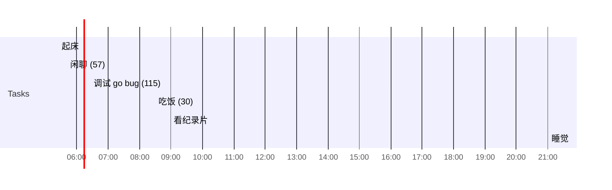

## Day Planner

## 今日学习方向
- [ ] vue
- [ ] 看书

## 记录

- [ ] 07:48 起床
- [ ] 08:08 Vue (189)
- [ ] 11:17 吃饭 (76)
- [ ] 12:33 VUE (32)
- [ ] 13:05 闲聊 (38)
- [ ] 13:58  VUE (54)
- [ ] 14:52 休息 (17)
- [ ] 15:09 睡觉(44)
- [ ] 16:19 闲聊 (60)
- [ ] 17:19 Git (89)
- [ ] 18:48 吃饭 (73)
- [ ] 20:09 Git (66)
- [ ] 21:15 看番(46) 
- [ ] 22:17 Git (103)
- [ ] 00:25 准备睡觉
- [ ] 00:45 睡觉

## 汇总

| 类型 | 时长 |
| ---- | ---- |
| 后期 | 0    |
| 编程 | 533  |
| 读书 | 0    |
| 课外 | 0    |
| 网站 | 0    |
| 娱乐 | 46   |
| 闲聊 | 98   |
| 睡眠 | 450  |
| 丢失 | 313 |

## 习惯
- [ ] 吃完饭立刻洗碗
- [ ] 吃完东西要漱口

## 格言
不走捷径，就是捷径

如果一个东西研究 1 小时还是茫然，还是先提升相关技能吧。

可以夜里把今天的总结了，并且把明天的工作安排好
