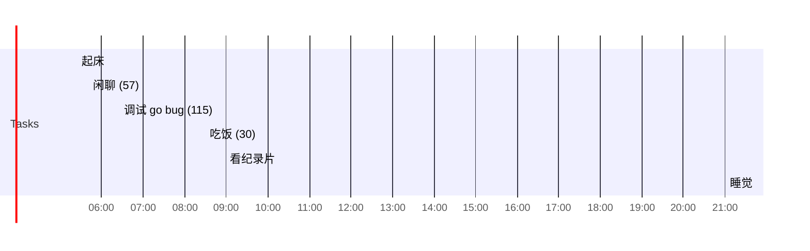

## Day Planner

## 今日学习方向
- [ ] git 个人网站、git
- [ ] vue
- [ ] yml

## 记录

- [ ] 08:28 起床
- [ ] 08:38 Git (100)
- [ ] 10:18 做饭 (95)
- [ ] 11:53 纪录片 (34)
- [ ] 12:27 睡觉 (105)
- [ ] 16:51 休息 (15)
- [ ] 17:06 纪录片 (130)
- [ ] 19:15 学习 (172)
- [ ] 22:47 学习 (181)
- [ ] 01:50 睡觉

## 汇总

| 类型 | 时长 |
| ---- | ---- |
| 后期 | 0    |
| 编程 | 453  |
| 读书 | 0    |
| 课外 | 34    |
| 网站 | 0    |
| 娱乐 | 0   |
| 闲聊 | 30   |
| 睡眠 | 568  |
| 逃逸 | 355  |

## 习惯
- [ ] 吃完饭立刻洗碗
- [ ] 吃完东西要漱口

## 格言
不走捷径，就是捷径

如果一个东西研究 1 小时还是茫然，还是先提升相关技能吧。

可以夜里把今天的总结了，并且把明天的工作安排好
