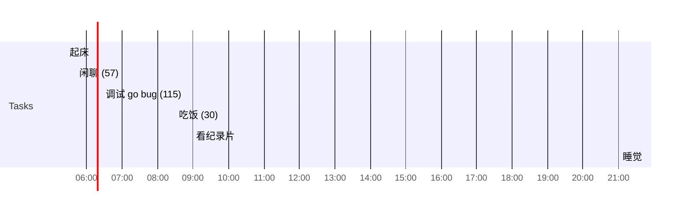

## Day Planner

## 今日学习方向
- [ ] https://github.com/xiaosansiji/cookbook-of-webdev
- [ ] https://github.com/xiaosansiji/cookbook-of-webdev/blob/master/web-dev-basic/index.md
- [ ] vue
- [ ] 

## 记录

- [ ] 08:00 起床
- [ ] 08:30 electron (70)
- [ ] 09:40 吃饭 (100)
- [ ] 11:20 纪录片( (100)
- [ ] 13:00 睡觉
- [ ] 14:08
- [ ] 16:33 ele (142)
- [ ] 18:55 吃饭
- [ ] 19:35 看书 (106)
- [ ] 21:16 Code (110)
- [ ] 23:08 纪录片
- [ ] 00:00 睡觉

## 汇总

| 类型 | 时长 |
| ---- | ---- |
| 后期 | 0    |
| 编程 | 0    |
| 读书 | 0    |
| 课外 | 0    |
| 网站 | 0    |
| 娱乐 | 0    |
| 闲聊 | 0    |
| 睡眠 | 0    |
| 逃逸 |      |

## 习惯
- [ ] 吃完饭立刻洗碗
- [ ] 吃完东西要漱口
- [ ] 时间逃逸不得超过 120 分钟

## 格言
不走捷径，就是捷径

如果一个东西研究 1 小时还是茫然，还是先提升相关技能吧。

可以夜里把今天的总结了，并且把明天的工作安排好
