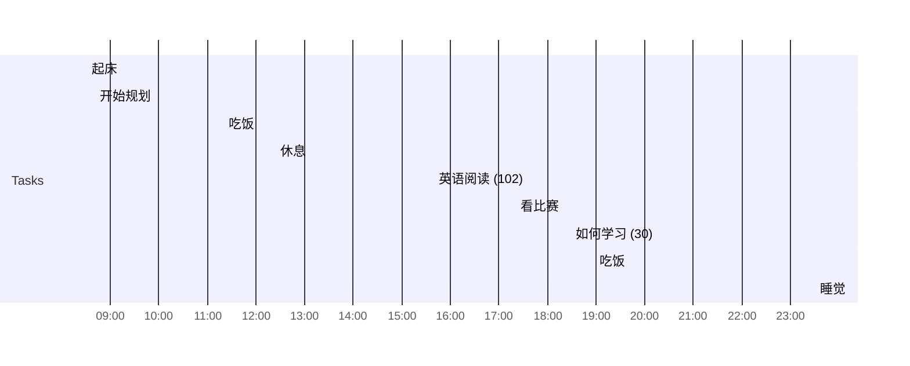

## Day Planner

## 今日学习方向
- [ ] 完整规划人生
- [ ] 记录想法
- [ ] 1512
- [ ] 每天应该有 10 分钟规划以及 20 分钟复习
- [ ] 目标
- [ ] 想做什么
- [ ] 切记盲目
- [ ] 人生技能表
- [ ] 语言学习
- [ ] 
- [ ] 

## 记录

- [ ] 08:30 起床
- [ ] 08:40 开始规划
- [ ] 11:19 吃饭
- [ ] 12:23 休息
- [ ] 15:38 英语阅读 (102)
- [ ] 17:20 看比赛
- [ ] 18:28 如何学习 (30)
- [ ] 18:58 吃饭
- [ ] 22:55
- [ ] 23:30 睡觉

## 汇总

| 类型 | 时长 |
| ---- | ---- |
| 后期 | 0    |
| 编程 | 0    |
| 读书 | 0    |
| 课外 | 0    |
| 网站 | 0    |
| 娱乐 | 0    |
| 闲聊 | 0    |
| 睡眠 | 0    |
| 逃逸 |      |

## 习惯
- [ ] 吃完饭立刻洗碗
- [ ] 吃完东西要漱口
- [ ] 时间逃逸不得超过 120 分钟

## 格言
不走捷径，就是捷径

如果一个东西研究 1 小时还是茫然，还是先提升相关技能吧。

可以夜里把今天的总结了，并且把明天的工作安排好

先做，做的时候再考虑效率