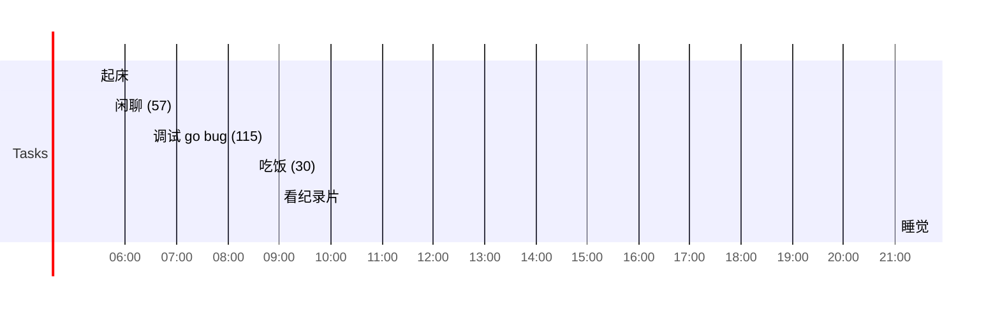

## Day Planner

## 今日学习方向
- [ ] 
- [ ] 

## 记录

- [ ] 08:00 起床
- [ ] 12:37 看书
- [ ] 13:00
- [ ] 16:25 做饭
- [ ] 00:00 睡觉

## 汇总

| 类型 | 时长 |
| ---- | ---- |
| 后期 | 0    |
| 编程 | 0    |
| 读书 | 0    |
| 课外 | 0    |
| 网站 | 0    |
| 娱乐 | 0    |
| 闲聊 | 0    |
| 睡眠 | 0    |
| 逃逸 |      |

